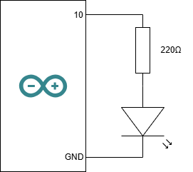
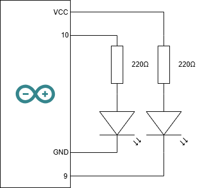
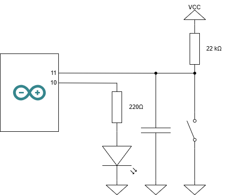
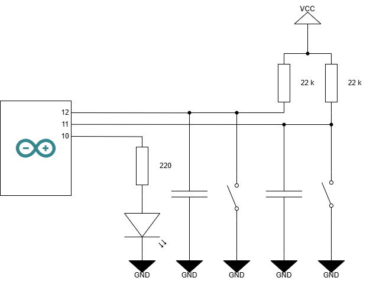
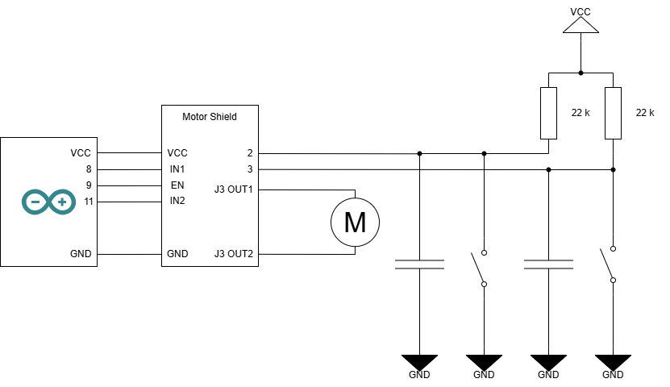
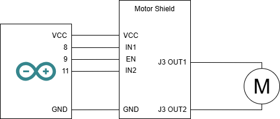

# アドバンスドラーニングⅡ

## 課題 2-1A：ボード内LEDの点滅周期変更

### 1. 回路仕様

* **配線:** Arduino UNO ボード上の内蔵LED（13番ピン）を使用（外付け回路不要）

### 2. 実装コード

```cpp
int LED_PIN = 13; // ボード内 LED ピンの番号をグローバル変数で定義

void setup()    // 最初に１回だけ起動される初期化処理
{ 
    pinMode(LED_PIN, OUTPUT); // LED_PIN を出力に設定
}

void loop()     // 無限に繰り返されるメイン処理
{
    digitalWrite(LED_PIN, HIGH); // LED_PIN に HIGH(5V)を出力、LED 点灯
    delay(100); // 100 ms 待機
    digitalWrite(LED_PIN, LOW); // LED_PIN に LOW(0V)を出力、LED 消灯
    delay(900); // 900 ms 待機
}
```

### 3. 解説

* **周期と周波数の関係:** 周期*T*=100 *ms* + 900 *ms* = 1000 *ms* = 1 *s* であり、点滅周波数は*f* = 1/T = 1/1 *s* = 1 *Hz*
* **delay()関数:** 指定した時間(ms)だけ処理を停止する関数。ここでは、LEDの点灯・消灯の間隔を制御するために使用。

<div style="break-before: page;"></div>

## 課題 2-2：SOSモールス信号の点滅

### 1. 回路仕様

* **配線:** Arduino UNO ボード上の内蔵LED（13番ピン）を使用（外付け回路不要）

### 2. 実装コード

```cpp
int LED_PIN = 13; // ボード内 LED ピンの番号をグローバル変数で定義
int UNIT_TIME = 100; // 点灯・消灯の基本単位時間をグローバル変数で定義（ms）

void setup()    // 最初に１回だけ起動される初期化処理
{ 
    pinMode(LED_PIN, OUTPUT); // LED_PIN を出力に設定
}

/**
 * @brief 点灯時間を表す関数
 * @details 点灯時間は1単位で、消灯時間は1単位の間隔を空ける
 */
void dot()
{
    digitalWrite(LED_PIN, HIGH);
    delay(UNIT_TIME);
    digitalWrite(LED_PIN, LOW);
    delay(UNIT_TIME); // 音間 (1単位)
}

/**
 * @brief 長点時間を表す関数
 * @details 点灯時間は3単位で、消灯時間は1単位の間隔を空ける
 */
void dash()
{
    digitalWrite(LED_PIN, HIGH);
    delay(UNIT_TIME * 3);
    digitalWrite(LED_PIN, LOW);
    delay(UNIT_TIME); // 音間 (1単位)
}

/**
 * @brief S点灯を表す関数
 * @details 最後の点灯後は、3単位の間隔を空けるので、点灯後に2単位の間隔を空ける
 */
void blinkS()
{
    dot();
    dot();
    dot();
    delay(UNIT_TIME * 2);
}

/**
 * @brief O点灯を表す関数
 * @details 最後の点灯後は、3単位の間隔を空けるので、点灯後に2単位の間隔を空ける
 */
void blinkO()
{
    dash();
    dash();
    dash();
    delay(UNIT_TIME * 2);
}

void loop()     // 無限に繰り返されるメイン処理
{
    blinkS();
    blinkO();
    blinkS();

    // Sの終了時に文字間(3単位)待機済みなので、単語間(7単位)待機するために、4単位の間隔を空ける
    delay(UNIT_TIME * 4);
}
```

### 3. 解説

* **待機時間積算:** 各符号（短音・長音）の直後に「音間（1単位）」の消灯を入れているため、文字間（3単位）にするには差分の2単位、単語間（7単位）にするには差分の4単位を追加待機させる必要がある。
* **関数分割:** 共通処理（dot, dash）を部品化して blinkS() や blinkO() を組み立てる構造化プログラミングを意識。

<div style="break-before: page;"></div>

## 課題 2-3：マイコン外のLEDによるSOSモールス信号の点滅

### 1. 回路仕様
* **配線:** Arduino UNO ボードの 10番ピンに外付けLEDを接続（抵抗は 220Ω を使用）



### 2. 実装コード
```cpp
int LED_PIN = 10; // ボード外 LED ピンの番号をグローバル変数で定義
int UNIT_TIME = 100; // 点灯・消灯の基本単位時間をグローバル変数で定義（ms）

void setup()    // 最初に１回だけ起動される初期化処理
{ 
    pinMode(LED_PIN, OUTPUT); // LED_PIN を出力に設定
}

/**
 * @brief 点灯時間を表す関数
 * @details 点灯時間は1単位で、消灯時間は1単位の間隔を空ける
 */
void dot()
{
    digitalWrite(LED_PIN, HIGH);
    delay(UNIT_TIME);
    digitalWrite(LED_PIN, LOW);
    delay(UNIT_TIME); // 音間 (1単位)
}

/**
 * @brief 長点時間を表す関数
 * @details 点灯時間は3単位で、消灯時間は1単位の間隔を空ける
 */
void dash()
{
    digitalWrite(LED_PIN, HIGH);
    delay(UNIT_TIME * 3);
    digitalWrite(LED_PIN, LOW);
    delay(UNIT_TIME); // 音間 (1単位)
}

/**
 * @brief S点灯を表す関数
 * @details 最後の点灯後は、3単位の間隔を空けるので、点灯後に2単位の間隔を空ける
 */
void blinkS()
{
    dot();
    dot();
    dot();
    delay(UNIT_TIME * 2);
}

/**
 * @brief O点灯を表す関数
 * @details 最後の点灯後は、3単位の間隔を空けるので、点灯後に2単位の間隔を空ける
 */
void blinkO()
{
    dash();
    dash();
    dash();
    delay(UNIT_TIME * 2);
}

void loop()     // 無限に繰り返されるメイン処理
{
    blinkS();
    blinkO();
    blinkS();

    // Sの終了時に文字間(3単位)待機済みなので、単語間(7単位)待機するために、4単位の間隔を空ける
    delay(UNIT_TIME * 4);
}
```

### 3. 解説

* **LEDの極性:** の長さ（長＝アノード、短＝カソード）を確認。
* **抵抗:** 220Ω 抵抗を挟まないと過電流でLEDおよびArduinoの出力ポートが破損する危険がある。

<div style="break-before: page;"></div>

## 課題 2-4: 2つのLEDを交互に点滅させる

### 1. 回路仕様
* **配線:** Arduino UNO ボードの 10番、9番ピンに外付けLEDを接続（抵抗は 220Ω を使用）



<div style="break-before: page;"></div>

### 2. 実装コード
```cpp

int LED_PIN = 10; // ボード内 LED ピンの番号をグローバル変数で定義
int LED_PIN2 = 9; // ボード内 LED ピンの番号をグローバル変数で定義

int Time1 = 200;        // 点灯・消灯の基本単位時間をグローバル変数で定義（ms）
int Time2 = 100;        // 点灯・消灯の基本単位時間をグローバル変数で定義（ms）
int TimeOff = 200;      // 点灯・消灯の基本単位時間をグローバル変数で定義（ms）
int TimeInterval = 500; // 点灯・消灯の基本単位時間をグローバル変数で定義（ms）
int ReeatCount = 3;     // 何回繰り返すかをグローバル変数で定義

void setup()    // 最初に１回だけ起動される初期化処理
{ 
    pinMode(LED_PIN, OUTPUT); // LED_PIN を出力に設定
    pinMode(LED_PIN2, OUTPUT); // LED_PIN2 を出力に設定

    // 初期状態を設定(両方のLEDを消灯)
    digitalWrite(LED_PIN, LOW);
    digitalWrite(LED_PIN2, HIGH); // led2は負論理なのでHIGHで消灯
}

void loop() // 無限に繰り返されるメイン処理
{
    for (int i = 0; i < ReeatCount; i++)
    {
        // led1を点灯、led2を消灯
        digitalWrite(LED_PIN, HIGH);
        digitalWrite(LED_PIN2, HIGH); // led2は負論理なのでHIGHで消灯
        delay(Time1);

        // led1を消灯、led2を点灯
        digitalWrite(LED_PIN, LOW);
        digitalWrite(LED_PIN2, LOW); // led2は負論理なのでLOWで点灯
        delay(Time2);

        // 両方のLEDを消灯
        digitalWrite(LED_PIN, LOW);
        digitalWrite(LED_PIN2, HIGH); // led2は負論理なのでHIGHで消灯
        delay(TimeOff);
    }

    // 3回繰り返した後、次の点滅までの間隔を空ける
    delay(TimeInterval);
}
```

### 3. 解説

* **負論理:** LED2のアノードは常時5Vに接続されているため、D9ピンがLOW（0V）になった瞬間のみ電位差（5V - 0V = 5V）が生じて点灯する。

<div style="break-before: page;"></div>

## 課題 2-5A: スイッチを押すとLEDが点灯し、もう一度押すと消灯する

### 1. 回路仕様
* **配線:** Arduino UNO ボードの 10番ピンに外付けLEDを接続（抵抗は 220Ω を使用）、11番ピンに外付けスイッチを接続（プルアップ抵抗を使用）、それらをGNDに接続



<div style="break-before: page;"></div>

### 2. 実装コード
```cpp

int LED_PIN = 10; // ボード内 LED ピンの番号をグローバル変数で定義
int SW_PIN  = 11; // 外部スイッチのピン番号をグローバル変数で定義

int ledState = LOW; // LEDの状態を保持する変数（初期値は消灯）
int LastButtonState = HIGH;    // スイッチの状態を保持する変数

void setup()
{
    pinMode(LED_PIN, OUTPUT); // LED_PIN を出力に設定
    pinMode(SW_PIN, INPUT); // SW_PIN を入力に設定
}

void loop()
{
    int currentSwState = digitalRead(SW_PIN); // スイッチの状態を読み取る

    // 離されいた状態から押された状態に変化した瞬間(立ち上がり)
    if (LastButtonState == HIGH && currentSwState == LOW)
    {
        ledState = !ledState; // LEDの状態を反転
        digitalWrite(LED_PIN, ledState); // LEDの状態を出力
    }
    LastButtonState = currentSwState; // スイッチの現在の状態を保存
}
```

### 3. 解説

* **エッジ検出:** スイッチが「LOWであるか」ではなく「HIGHからLOWに変わった瞬間」を捉えないと、長押し時に高速点滅してしまうこと注意。
* **プルアップ抵抗:** スイッチが押されていない状態では、入力ピンはHIGHに保たれるようにするため、プルアップ抵抗を使用する。
* **LEDの状態保持:** `ledState` 変数を使用して、LEDの現在の状態（点灯/消灯）を保持し、スイッチが押されるたびに反転させることで、トグル動作にしてる。

<div style="break-before: page;"></div>

## 課題 2-5B: 2つのスイッチを押すとLEDの点滅周波数が変化する

### 1. 回路仕様
* **配線:** Arduino UNO ボードの 10番ピンに外付けLEDを接続（抵抗は 220Ω を使用）、11番ピンに外付けスイッチ1を接続、12番ピンに外付けスイッチ2を接続（プルアップ抵抗を使用）、それらをGNDに接続



<div style="break-before: page;"></div>

### 2. 実装コード
```cpp

int LED_PIN = 10; // ボード内 LED ピンの番号をグローバル変数で定義
int SW1_PIN = 11; // ボード内 LED ピンの番号をグローバル変数で定義
int SW2_PIN = 12; // ボード内 LED ピンの番号をグローバル変数で定義

float freq = 1.0; // 初期周波数 1Hz

void setup()
{
    pinMode(LED_PIN, OUTPUT); // LED_PIN を出力に設定
    pinMode(SW1_PIN, INPUT); // SW1_PIN を入力に設定
    pinMode(SW2_PIN, INPUT); // SW2_PIN を入力に設定
}

void loop()
{
    // SW1が押されている(LOW)なら集荷数増加
    if (digitalRead(SW1_PIN) == LOW)
    {
        // 集荷数を増加させる処理
        freq += 1.0;
        if (freq > 100.0)
        {
            freq = 100.0;
        }
    }
    // SW2が押されている(LOW)なら集荷数減少
    if (digitalRead(SW2_PIN) == LOW)
    {
        // 集荷数を減少させる処理
        freq -= 1.0;
        if (freq < 1.0)
        {
            freq = 1.0;
        }
    }

    // 周波数から周期T[ms]と半周期[ms]を計算
    float T = 1000.0 / freq; // 周期T[ms] = 1000 / freq[Hz]
    int halfT = (int)(T / 2.0); // 半周期[ms] = T / 2

    // デューティ比50%でLEDを点滅させる
    digitalWrite(LED_PIN, HIGH); // LEDを点灯
    delay(halfT); // 半周期待機
    digitalWrite(LED_PIN, LOW); // LEDを消灯
    delay(halfT); // 半周期待機
}
```

### 3. 解説

* **周波数の変更:** SW1を押すと周波数が増加し、SW2を押すと周波数が減少するようにしている。周波数は1Hzから100Hzまでの範囲で制御される。
* **周期と半周期の計算:** 周波数から周期Tを計算し、半周期を求めることで、LEDの点滅をデューティ比50%で制御している。

<div style="break-before: page;"></div>

## 課題 3-1A: 2つのスイッチでモータの回転方向を制御する

### 1. 回路仕様
* **配線:** Arduino UNO ボードの 9番ピンにモータの有効化ピンを接続、8番ピンにモータの入力ピン1を接続、11番ピンにモータの入力ピン2を接続、ここまではArduino UNOボードにMotor Shieldを上からつければよい。2番ピンに正転スイッチを接続、3番ピンに逆転スイッチを接続（プルアップ抵抗を使用）、それらをGNDに接続



<div style="break-before: page;"></div>

### 2. 実装コード
```cpp

int MOTOR_EN  =  9; // モータの有効化ピンの番号をグローバル変数で定義
int MOTOR_IN1 =  8; // モータの入力ピン1の番号をグローバル変数で定義
int MOTOR_IN2 = 11; // モータの入力ピン2の番号をグローバル変数で定義

int SW1_PIN = 2; // 正転スイッチ
int SW2_PIN = 3; // 逆転スイッチ

void setup()
{
    pinMode(MOTOR_EN, OUTPUT); // MOTOR_EN を出力に設定
    pinMode(MOTOR_IN1, OUTPUT); // MOTOR_IN1 を出力に設定
    pinMode(MOTOR_IN2, OUTPUT); // MOTOR_IN2 を出力に設定

    pinMode(SW1_PIN, INPUT); // SW1_PIN を入力に設定
    pinMode(SW2_PIN, INPUT); // SW2_PIN を入力に設定
}

/**
 * @brief モータを正転させる関数
 * 
 */
void MotorCW()
{
    digitalWrite(MOTOR_EN, HIGH);   // モータを有効化
    digitalWrite(MOTOR_IN1, HIGH); // モータの入力ピン1をHIGHに設定
    digitalWrite(MOTOR_IN2, LOW);  // モータの入力ピン2をLOWに設定
}

/**
 * @brief モータを逆転させる関数
 * 
 */
void MotorCCW()
{
    digitalWrite(MOTOR_EN, HIGH);   // モータを有効化
    digitalWrite(MOTOR_IN1, LOW);  // モータの入力ピン1をLOWに設定
    digitalWrite(MOTOR_IN2, HIGH); // モータの入力ピン2をHIGHに設定
}

/**
 * @brief モータを停止させる関数
 * 
 */
void MotorStop()
{
    digitalWrite(MOTOR_EN, LOW);   // モータを無効化
}


void loop()
{
    int sw1 = digitalRead(SW1_PIN); // SW1の状態を読み取る
    int sw2 = digitalRead(SW2_PIN); // SW2の状態を読み取る

    // 負論理：押すとLOW
    // 両方押し（LOW, LOW）または　両方離し（HIGH, HIGH）の場合は停止
    if ((sw1 == LOW && sw2 == LOW) || (sw1 == HIGH && sw2 == HIGH))
    {
        MotorStop();
    }
    else if (sw1 == LOW) // SW1が押されている場合は正転
    {
        MotorCW();
    }
    else if (sw2 == LOW) // SW2が押されている場合は逆転
    {
        MotorCCW();
    }
}
```

### 3. 解説

* **モータの制御:** モータの回転方向は、入力ピン1と入力ピン2のHIGH/LOWの組み合わせで決まる。正転の場合は入力ピン1をHIGH、入力ピン2をLOWに設定し、逆転の場合はその逆に設定する。
* **スイッチの状態:** スイッチは負論理で接続されており、押すとLOW、離すとHIGHとなる。両方のスイッチが押されている場合や両方が離されている場合はモータを停止させる。

<div style="break-before: page;"></div>

## 課題 3-2A: 2つのスイッチでモータの速度を制御する

### 1. 回路仕様
* **配線:** Arduino UNO ボードの 9番ピンにモータの有効化ピンを接続、8番ピンにモータの入力ピン1を接続、11番ピンにモータの入力ピン2を接続、ここまではArduino UNOボードにMotor Shieldを上からつければよい。2番ピンに増速スイッチを接続、3番ピンに減速スイッチを接続（プルアップ抵抗を使用）、それらをGNDに接続


<div style="break-before: page;"></div>

### 2. 実装コード
```cpp

int MOTOR_EN  =  9; // モータの有効化ピンの番号をグローバル変数で定義
int MOTOR_IN1 =  8; // モータの入力ピン1の番号をグローバル変数で定義
int MOTOR_IN2 = 11; // モータの入力ピン2の番号をグローバル変数で定義

int SW1_PIN = 2; // 増速
int SW2_PIN = 3; // 減速

int speedVal = 0; // モータの速度を保持する変数（初期値は停止）

void setup()
{
    pinMode(MOTOR_EN, OUTPUT);
    pinMode(MOTOR_IN1, OUTPUT);
    pinMode(MOTOR_IN2, OUTPUT);

    pinMode(SW1_PIN, INPUT);
    pinMode(SW2_PIN, INPUT);

    // 正転方向に固定
    digitalWrite(MOTOR_IN1, HIGH);
    digitalWrite(MOTOR_IN2, LOW);
}

void loop()
{
    // SW1が押されている(LOW)なら速度増加
    if (digitalRead(SW1_PIN) == LOW)
    {
        speedVal += 1; // 速度を増加
        if (speedVal > 255)
        {
            speedVal = 255; // 最大値に制限
        }
    }
    // SW2が押されている(LOW)なら速度減少
    if (digitalRead(SW2_PIN) == LOW)
    {
        speedVal -= 1; // 速度を減少
        if (speedVal < 0)
        {
            speedVal = 0; // 最小値に制限
        }
    }

    analogWrite(MOTOR_EN, speedVal); // モータの速度を設定
    delay(30); // 速度変更の反映を待つ
}
```

### 3. 解説

* **速度の変更:** SW1を押すとモータの速度が増加し、SW2を押すとモータの速度が減少するようにしている。速度は0から255までの範囲で制御される。
* **PWM制御:** `analogWrite`関数を使用して、モータの有効化ピンにPWM信号を出力し、速度を制御している。

<div style="break-before: page;"></div>

## 課題 3-2B: 2つのスイッチでモータの速度を制御する

### 1. 回路仕様
* **配線:** Arduino UNO ボードの 9番ピンにモータの有効化ピンを接続、8番ピンにモータの入力ピン1を接続、11番ピンにモータの入力ピン2を接続、ここまではArduino UNOボードにMotor Shieldを上からつければよい。



<div style="break-before: page;"></div>

### 2. 実装コード
```cpp

int MOTOR_EN  =  9; // モータの有効化ピンの番号をグローバル変数で定義
int MOTOR_IN1 =  8; // モータの入力ピン1の番号をグローバル変数で定義
int MOTOR_IN2 = 11; // モータの入力ピン2の番号をグローバル変数で定義

void setup()
{
    pinMode(MOTOR_EN, OUTPUT);
    pinMode(MOTOR_IN1, OUTPUT);
    pinMode(MOTOR_IN2, OUTPUT);
}

void loop()
{
    // 1. 正転方向に設定
    digitalWrite(MOTOR_IN1, HIGH);
    digitalWrite(MOTOR_IN2, LOW);

    for (int s = 0; s <= 255; s++)
    {
        analogWrite(MOTOR_EN, s);
        delay(15);
    }
    for (int s = 255; s >= 0; s--)
    {
        analogWrite(MOTOR_EN, s);
        delay(15);
    }

    delay(200); // 反転前の休止

    // 2. 逆転方向に設定
    digitalWrite(MOTOR_IN1, LOW);
    digitalWrite(MOTOR_IN2, HIGH);

    for (int s = 0; s <= 255; s++)
    {
        analogWrite(MOTOR_EN, s);
        delay(15);
    }
    for (int s = 255; s >= 0; s--)
    {
        analogWrite(MOTOR_EN, s);
        delay(15);
    }

    delay(200);
}
```

### 3. 解説

* **速度の変化:** モータの速度を徐々に増加させ、最大値に達したら徐々に減少させることで、モータの回転速度を滑らかに制御している。
* **正転・逆転の切り替え:** モータの入力ピンの状態を切り替えることで、正転と逆転を制御している。
* **デッドバンド:** デューティ比が小さい領域では静止摩擦にトルクが負けるため、モータが回転を始めない現象は正常な物理特性。

<div style="break-before: page;"></div>

## 課題 4-1A: 2つのスイッチでモータの回転方向を制御する

### 1. 回路仕様
* **配線:** Arduino UNO ボードの 10番ピンにサーボモータの制御ピンを接続、サーボモータのVCCを外部電源である電池ボックスの+に接続、GNDをArduinoと電池ボックスのGNDに接続


<div style="break-before: page;"></div>

### 2. 実装コード
```cpp

int SERVO_PIN = 10; // サーボモータの制御ピンの番号をグローバル変数で定義

void setup()
{
    pinMode(SERVO_PIN, OUTPUT);
}

void servo_set(int theta, int period)
{
    // テキストの式: A = 500 + (1900 * theta) / 180 [us]
    long A = 500 + (1900 * (long)theta) / 180; // パルス幅を計算
    long low_time = 20000 - A; // LOW時間を計算（20ms周期）

    int cycles = period * 50; // 20ms周期のため1秒間に50回パルスを送信

    for (int i = 0; i < cycles; i++)
    {
        digitalWrite(SERVO_PIN, HIGH);
        delayMicroseconds(A); // HIGH時間を待機
        digitalWrite(SERVO_PIN, LOW);

        // delayMicrosecondsは最大約16,383usのため2回に分けて待機
        delayMicroseconds(low_time - 10000); // LOW時間を待機
        delayMicroseconds(10000); // LOW時間を待機
    }
}

void loop()
{
    servo_set(0, 2);   // 0度で2秒間保持
    servo_set(90, 1);  // 90度で1秒間保持
    servo_set(180, 2); // 180度で2秒間保持
    servo_set(90, 1);  // 90度で1秒間保持
}
```

### 3. 解説

#### ① パルス幅制御の原理と計算式の導出
* **PWMによる角度指定:** サーボモータは周期 $T = 20\text{ ms}$（周波数 $50\text{ Hz}$）のパルス信号を受け取り、パルスのHIGH時間（パルス幅 $A$）に応じて回転角度が決まる。
* **仕様値:** 本実験のサーボモータはパルス幅 $500\,\mu\text{s}$ のとき $0^\circ$、パルス幅 $2400\,\mu\text{s}$ のとき $180^\circ$ となる。
* **テキスト掲載の式（テキスト p.16）:**
  $$\theta = \theta_{min} + (\theta_{max} - \theta_{min}) \times \frac{A - 500}{2400 - 500}$$

  $\theta_{min} = 0$、$\theta_{max} = 180$ を代入すると、以下の関係になる。
  $$\theta = 180 \times \frac{A - 500}{1900}$$

* **パルス幅 $A$ の逆算:**
  関数 `servo_set(theta, period)` では指定された目標角度 $\theta$ からマイコンが出力すべきパルス幅 $A\,[\mu\text{s}]$ を求める必要があるため、式を $A$ について変形する。
  $$\frac{\theta}{180} = \frac{A - 500}{1900}$$
  $$A - 500 = \frac{1900 \times \theta}{180}$$
  $$A = 500 + \frac{1900 \times \theta}{180}$$

#### ② ループ回数（`cycles`）の計算
* 周期 $T = 20\text{ ms}$ のパルスを1秒間に送信する回数は $1000\text{ ms} / 20\text{ ms} = 50\text{ 回}$ である。
* したがって、指定時間 `period` [秒] だけ姿勢を保持するためには、パルス出力を `period * 50` 回繰り返す。

---

### 4. コードの詳細実装に対する技術的考察（TA向け）

提示したコードには、マイコンのハードウェア制約を踏まえた配慮が2点組み込まれている。

* **`long` 型キャストの必要性（必須）:**
  Arduino UNO（ATmega328P）の `int` 型は16ビット符号付き整数（$-32,768 \sim 32,767$）である。もし `int A = 500 + (1900 * theta) / 180;` と記述した場合、例えば $\theta = 90$ で計算途中の $1900 \times 90 = 171,000$ が16ビットの上限を超えてオーバーフローを起こし、意図しない数値になってサーボが暴走する。これを防ぐために `(long)theta` や `1900L` を用いて32ビット演算を行わせる処理は必須である。
* **`delayMicroseconds()` の分割処理（簡略化可能）:**
  Arduinoの `delayMicroseconds()` は仕様上、引数として渡せる最大値が $16,383\,\mu\text{s}$ に制限されている。周期 $20,000\,\mu\text{s}$ のうちLOW側の時間は約 $17,600 \sim 19,500\,\mu\text{s}$ となり上限を超えるため、コード例では2回に分割して待機している。

---

### 5. シンプルに書く場合の別解（テキスト list 4-1A 準拠）

LOW時間を分割する代わりに、テキストp.17の `list 4-1A` と同様に「ミリ秒待機の `delay(17)`」と「マイクロ秒待機の `delayMicroseconds(3000 - A)`」を組み合わせることで、特殊な分割記述を行わずに分かりやすく実装できる。
<div style="break-before: page;"></div>

```cpp
void servo_set(int theta, int period)
{
    // オーバーフロー防止のため 32bit (long) で計算
    long A = 500 + (1900L * theta) / 180;

    int cycles = period * 50; // 1秒あたり50サイクル

    for (int i = 0; i < cycles; i++)
    {
        digitalWrite(SERVO_PIN, HIGH);
        delayMicroseconds(A);               // HIGH出力

        digitalWrite(SERVO_PIN, LOW);
        delayMicroseconds(3000 - A);         // 可変部（3ms）の残り待機
        delay(17);                          // 固定部（17ms）待機
    }
}
```

周期 $20\text{ ms}$ を「可変部 $3\text{ ms} = 3,000\,\mu\text{s}$」と「固定部 $17\text{ ms}$」に分けることで、`delayMicroseconds` の上限（$16,383\,\mu\text{s}$）を回避できる。学生がこの構成で解答を作成した場合も、テキストの構成に忠実な満点の解答として扱う。

<div style="break-before: page;"></div>

## 課題 4-2A: 2つのスイッチでモータの速度を制御する

### 1. 回路仕様
* **配線:** Arduino UNO ボードの 10番ピンにサーボモータの制御ピンを接続、サーボモータのVCCを外部電源である電池ボックスの+に接続、GNDをArduinoと電池ボックスのGNDに接続


<div style="break-before: page;"></div>

### 2. 実装コード
```cpp

#include <Servo.h>

Servo myservo; // サーボモータのオブジェクトを生成
int SERVO_PIN = 10; // サーボモータの制御ピンの番号をグローバル変数で定義

void setup()
{
    myservo.attach(SERVO_PIN); // サーボモータを初期化
}

void loop()
{
    // 0°~>180°までサーボを動かす(2500ms / 180 ステップ　≒ 14msウェイト)
    for (int i = 0; i <= 180; i++)
    {
        myservo.write(i);
        delay(14);
    }

    // 180°~>0°までサーボを動かす(2500ms / 180 ステップ　≒ 14msウェイト)
    for (int i = 180; i >= 0; i--)
    {
        myservo.write(i);
        delay(14);
    }
}
```

### 3. 解説
* **サーボモータの制御:** ArduinoのServoライブラリを使用することで、PWM信号の生成やパルス幅の計算を自動で行うことができる。`myservo.write(angle)` メソッドを使用して、指定した角度にサーボモータを回転させることができる。
<div style="break-before: page;"></div>

## 課題 4-2B: 2つのスイッチでモータの速度を制御する

### 1. 回路仕様
* **配線:** Arduino UNO ボードの 10番ピンにサーボモータの制御ピンを接続、サーボモータのVCCを外部電源である電池ボックスの+に接続、GNDをArduinoのGNDおよび電池ボックスのGNDに接続。さらに、Arduino UNO ボードの 2番ピンに22kΩ抵抗を介してArduinoの5V（VCC）へプルアップ接続し、タクトスイッチおよび並列接続したコンデンサを介してArduinoのGNDに接続する。


<div style="break-before: page;"></div>

### 2. 実装コード

```cpp

#include <Servo.h>

Servo myservo; // サーボモータのオブジェクトを生成
int SERVO_PIN = 10; // サーボモータの制御ピンの番号をグローバル変数で定義
int SW_PIN = 2; // スイッチのピン番号をグローバル変数で定義

int currentPos = 0; // サーボの現在位置を保持する変数
int dir = 1; // サーボの回転方向を保持する変数（1: 正方向, -1: 逆方向）

void setup()
{
    myservo.attach(SERVO_PIN);  // サーボモータを初期化
    myservo.write(currentPos);  // サーボを初期位置に設定
    pinMode(SW_PIN, INPUT);     // スイッチを入力ピンとして設定
}

void loop()
{
    // スイッチが押されてるとき(LOW)のみ首振り動作
    if (digitalRead(SW_PIN) == LOW)
    {
        currentPos += dir; // 現在位置を更新

        // 0°または180°に到達したら方向を反転
        if (currentPos >= 180)
        {
            currentPos = 180; // 上限を180°に制限
            dir = -1; // 方向を逆にする
        }
        else if (currentPos <= 0)
        {
            currentPos = 0; // 下限を0°に制限
            dir = 1; // 方向を正にする
        }
    }

    myservo.write(currentPos); // サーボを現在位置に設定
    delay(14); // サーボの動作速度を制御するためのウェイト
}
```

### 3. 解説

* **サーボモータの制御:** ArduinoのServoライブラリを使用することで、PWM信号の生成やパルス幅の計算を自動で行うことができる。`myservo.write(angle)` メソッドを使用して、指定した角度にサーボモータを回転させることができる。
* **スイッチの使用:** スイッチが押されている間のみサーボモータが首振り動作を行うようにしている。スイッチが押されていない場合は、サーボモータは現在位置で停止する。
* **首振り動作の制御:** サーボモータの現在位置を保持する変数 `currentPos` を使用し、方向を保持する変数 `dir` を使って、0°から180°までの範囲で首振り動作を行う。