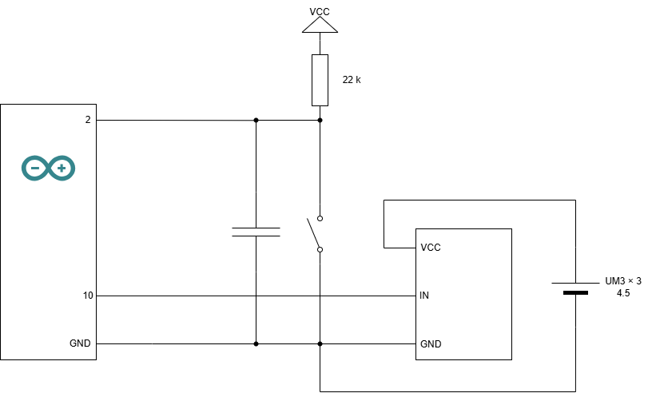

## 課題 4-2A: 2つのスイッチでモータの速度を制御する

### 1. 回路仕様
* **配線:** Arduino UNO ボードの 10番ピンにサーボモータの制御ピンを接続、サーボモータのVCCを外部電源である電池ボックスの+に接続、GNDをArduinoと電池ボックスのGNDに接続する。


<div style="break-before: page;"></div>

### 2. 実装コード
```cpp

#include <Servo.h>

Servo myservo; // サーボモータのオブジェクトを生成
int SERVO_PIN = 10; // サーボモータの制御ピンの番号をグローバル変数で定義

void setup()
{
    myservo.attach(SERVO_PIN); // サーボモータを初期化
}

void loop()
{
    // 0°~>180°までサーボを動かす(2500ms / 180 ステップ　≒ 14msウェイト)
    for (int i = 0; i <= 180; i++)
    {
        myservo.write(i);
        delay(14);
    }

    // 180°~>0°までサーボを動かす(2500ms / 180 ステップ　≒ 14msウェイト)
    for (int i = 180; i >= 0; i--)
    {
        myservo.write(i);
        delay(14);
    }
}
```

### 3. 解説
* **サーボモータの制御:** ArduinoのServoライブラリを使用することで、PWM信号の生成やパルス幅の計算を自動で行うことができる。`myservo.write(angle)` メソッドを使用して、指定した角度にサーボモータを回転させることができる。
<div style="break-before: page;"></div>

## 課題 4-2B: 2つのスイッチでモータの速度を制御する

### 1. 回路仕様
* **配線:** Arduino UNO ボードの 10番ピンにサーボモータの制御ピンを接続、サーボモータのVCCを外部電源である電池ボックスの+に接続、GNDをArduinoのGNDおよび電池ボックスのGNDに接続。さらに、Arduino UNO ボードの 2番ピンに22kΩ抵抗を介してArduinoの5V（VCC）へプルアップ接続し、タクトスイッチおよび並列接続したコンデンサを介してArduinoのGNDに接続する。



<div style="break-before: page;"></div>

### 2. 実装コード
```cpp

#include <Servo.h>

Servo myservo; // サーボモータのオブジェクトを生成
int SERVO_PIN = 10; // サーボモータの制御ピンの番号をグローバル変数で定義
int SW_PIN = 2; // スイッチのピン番号をグローバル変数で定義

int currentPos = 0; // サーボの現在位置を保持する変数
int dir = 1; // サーボの回転方向を保持する変数（1: 正方向, -1: 逆方向）

void setup()
{
    myservo.attach(SERVO_PIN);  // サーボモータを初期化
    myservo.write(currentPos);  // サーボを初期位置に設定
    pinMode(SW_PIN, INPUT);     // スイッチを入力ピンとして設定
}

void loop()
{
    // スイッチが押されてるとき(LOW)のみ首振り動作
    if (digitalRead(SW_PIN) == LOW)
    {
        currentPos += dir; // 現在位置を更新

        // 0°または180°に到達したら方向を反転
        if (currentPos >= 180)
        {
            currentPos = 180; // 上限を180°に制限
            dir = -1; // 方向を逆にする
        }
        else if (currentPos <= 0)
        {
            currentPos = 0; // 下限を0°に制限
            dir = 1; // 方向を正にする
        }
    }

    myservo.write(currentPos); // サーボを現在位置に設定
    delay(14); // サーボの動作速度を制御するためのウェイト
}
```

### 3. 解説
* **サーボモータの制御:** ArduinoのServoライブラリを使用することで、PWM信号の生成やパルス幅の計算を自動で行うことができる。`myservo.write(angle)` メソッドを使用して、指定した角度にサーボモータを回転させることができる。
* **スイッチの使用:** スイッチが押されている間のみサーボモータが首振り動作を行うようにしている。スイッチが押されていない場合は、サーボモータは現在位置で停止する。
* **首振り動作の制御:** サーボモータの現在位置を保持する変数 `currentPos` を使用し、方向を保持する変数 `dir` を使って、0°から180°までの範囲で首振り動作を行う。